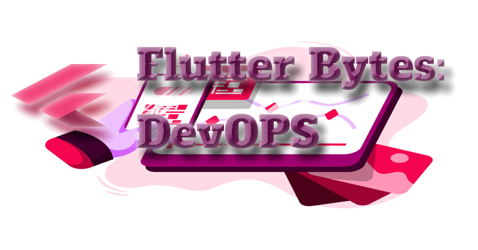
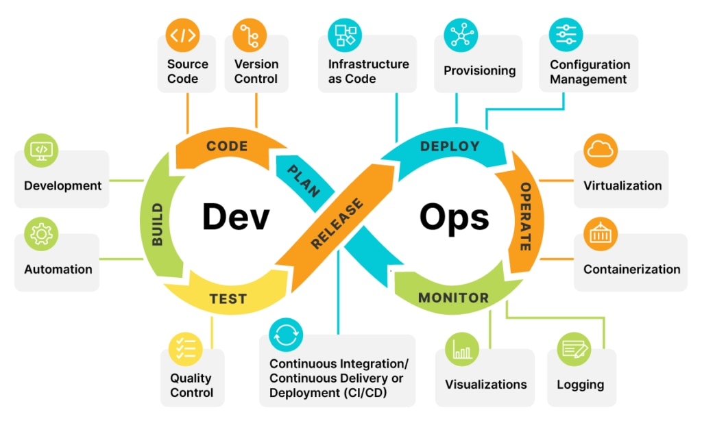

# Flutter Bytes: DevOPS

This is the core of devOPS in this diagram:

This is part of my approach towards a full Flutter and Dart
book series with the flutter bytes hub listing all the
code repos and articles at:

[Flutter Bytes Hub](https://github.com/fredgrott/flutter_bytes_hub)

Git Operations practice is a separate repo:

[Git operations practice]()

And the CI example is a separate repo:

[CI example]()

## Articles

[Missing In The Flutter SDK, Correct App Launcer Icons](https://fredgrott.medium.com/missing-in-the-flutter-sdk-correct-app-launcher-icons-a030a4ee0978?sk=e15699d758fc331cda994b72074d86bc)

[Flutter Expert Way To Set Up Static Code Analysis](https://fredgrott.medium.com/flutter-expert-way-to-set-up-static-code-analysis-0c77346bee4c?sk=f7888eb91ae3006d4bb900bb175bcfd3)

[Flutter OOP Way To Initialize Logging And Appenders](https://fredgrott.medium.com/flutter-oop-way-to-initialize-logging-and-appenders-59a5c29be94d?sk=c4400d9ecb44e77626ff920ee41b6d1a)

[Internationalizing Flutter Apps Is Hard Unless You Use My Way](https://fredgrott.medium.com/internationalizing-flutter-apps-is-hard-unless-you-use-my-way-a68884dadc76?sk=71f4a63fd7fb6c5f401f81906a2c6b1f)

[Expert Best Flutter App Build Machines Is It Apple Or Not](https://fredgrott.medium.com/expert-best-flutter-app-build-machines-is-it-apple-or-not-0b88704773ac?sk=e5bb87e48944cee6884e723c20b574b3)

[Avoiding Apple Tax With AMD, My Flutter Studio](https://fredgrott.medium.com/avoiding-apple-tax-with-amd-my-flutter-studio-b6b67e19781f?sk=324c676471a8dddff87df8ad5474e59c)

## License

Code is under BSD-clause-3 license and copyright 2023 Fredrick Allan Grott.